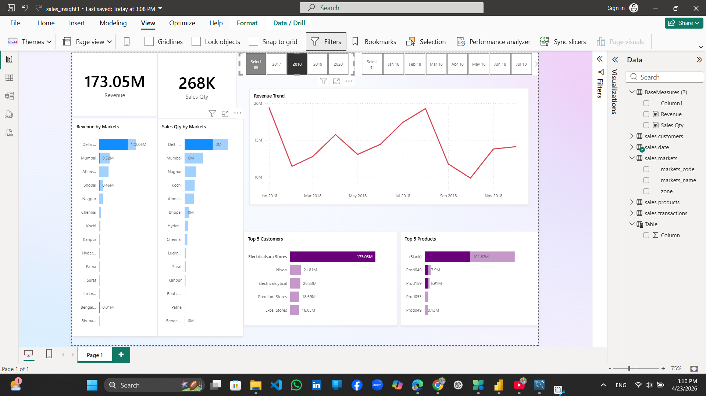

# Sales Insights Analysis

## 📊 Project Overview
This project provides a comprehensive business intelligence solution for AtliQ Hardware, a company supplying electronics to various retailers across India. The goal was to provide the Sales Director with a "single version of the truth" regarding declining revenue and regional performance.

  

## 🛠️ Tech Stack
* **Database:** MySQL (Data Storage & Discovery)
* **BI Tool:** Microsoft Power BI Desktop
* **ETL:** Power Query (M Language)
* **Modeling:** Star Schema
* **Analytics:** DAX (Data Analysis Expressions)

## 🏗️ Project Architecture
The project follows a standard professional data pipeline:
1. **Data Discovery:** Running SQL queries on the MySQL database to understand the data volume and identify "dirty" records.
2. **ETL (Extract, Transform, Load):** Connecting Power BI to the database and cleaning data (handling currency mismatches, invalid amounts, and regional filters).
3. **Data Modeling:** Establishing relationships between Fact (Transactions) and Dimension (Customers, Markets, Products, Date) tables.
4. **Dashboard Building:** Creating interactive visuals to track Revenue, Sales Quantity, and Market Trends.

## 🧹 Key Data Cleaning Steps (Power Query)
One of the core challenges was handling inconsistent data. Key transformations included:
* **Currency Normalization:** Converted all USD transactions to INR.
  * *Formula:* `= Table.AddColumn(#"Filtered Rows", "norm_amount", each if [currency] = "USD" or [currency] ="USD#(cr)" then [sales_amount]*75 else [sales_amount])`
* **Filtering Invalid Data:** Removed transactions with sales amounts of `0` or `-1`.
* **Regional Scoping:** Filtered out markets outside of India (New York, Paris) to focus on the current business strategy.

## 📈 Dashboard Insights
The final dashboard answers critical business questions:
* **Revenue Trend:** Visualizes the sharp decline in revenue from 2019 to 2020.
* **Top Performers:** Identifies the top 5 customers and products contributing to total sales.
* **Regional Deep-Dive:** Allows the Sales Director to filter performance by specific zones (North, South, Central).

## 🚀 How to Use
1. **Database:** Import the `db_dump.sql` file into your local MySQL server.
2. **Power BI:** Open `Sales_Insights.pbix`.
3. **Connection:** Update the data source settings to point to your local MySQL instance.

## 👤 Author
**Murad Amin**
*Software Engineer & Data Analyst*
[GitHub](https://github.com/Muradamen) | [LinkedIn](www.linkedin.com/in/muradamin)
